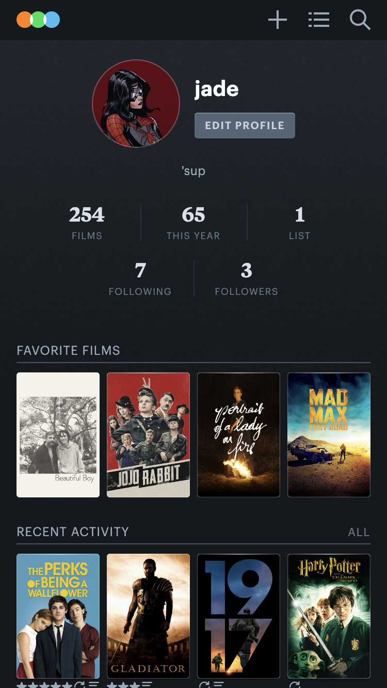
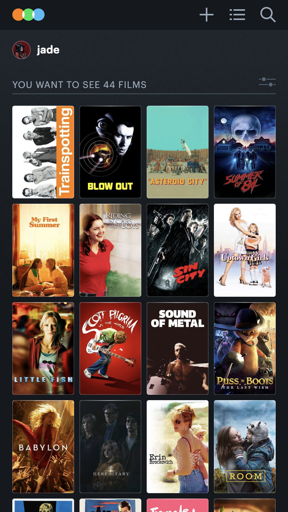

# Procesverslag
Markdown is een simpele manier om HTML te schrijven. 
Markdown cheat cheet: [Hulp bij het schrijven van Markdown](https://github.com/adam-p/markdown-here/wiki/Markdown-Cheatsheet).

Nb. De standaardstructuur en de spartaanse opmaak van de README.md zijn helemaal prima. Het gaat om de inhoud van je procesverslag. Besteedt de tijd voor pracht en praal aan je website.

Nb. Door *open* toe te voegen aan een *details* element kun je deze standaard open zetten. Fijn om dat steeds voor de relevante stuk(ken) te doen.

## Jij

uitwerken voor kick-off werkgroep

### Auteur:
Jade van Schaik (vervangen door jouw naam)

#### Je startniveau:
Blauw (kies uit zwart, rood óf blauw)

#### Je focus:
Responsive (kies uit responsive óf surface plane)

## Je website

uitwerken voor kick-off werkgroep

### Je opdracht:
link naar de website die je gaat namaken óf de naam/omschrijving van je eigen ontwerp

#### Screenshot(s) van de eerste pagina (small screen): 
hier de naam van de pagina 

#### Screenshot(s) van de tweede pagina (small screen):
hier de naam van de pagina 

## Toegankelijkheidstest 1/2 (week 1)

uitwerken na test in 2e werkgroep

### Bevindingen
Lijst met je bevindingen die in de test naar voren kwamen:
1. Te weinig uitleg bij alt-texten van images en video's.
2. Onwijs veel classes en id's.
3. Onwijs veel gebruik van div's en onduidelijke sections.
4. Onduidelijke verdeling van content maakt het navigeren door de pagina met keyboard moeilijk.

## Breakdownschets (week 1)

uitwerken na afloop 3e werkgroep

### de hele pagina: 

### dynamisch deel (bijv menu): 

### wellicht nog een dynamisch deel (bijv filter): 

## Voortgang 1 (week 2)

uitwerken voor 1e voortgang

### Stand van zaken

Begon deze opdracht met het invoegen van al mijn HTML, zodat ik al mijn content al in de website heb staan en later de CSS kan toepassen.
Ik ben ook begonnen met de header. Ik wou zo snel mogelijk een idee krijgen van de site, de styling en de content. Ook ben ik begonnen met de eerste section, de profiel-foto, button, titel, en biografie. 

### Agenda voor meeting
samen met je groepje opstellen

!! Gesprekjes werden uiteindelijk individueel niet in groepsverband.

| Ik | student 2 | student 3 | student 4 |
| --- | --- | --- | --- |
| Hulp met grid | en dit | en ik dit | en dan ik dat |
| | dit als er tijd is | nog een punt | dit wil ik zeker |
| | ... | ... | ... |

### Verslag van meeting
hier na afloop snel de uitkomsten van de meeting vastleggen

- Grid gebruiken voor de bovenkant van de pagina.
- Bij de UL onder de bovenkanste section, met de cijfers en letters in dezelfde li, gebruik maken van SPANs.

## Voortgang 2 (week 3)

uitwerken voor 2e voortgang

### Stand van zaken
Eerste section en de UL eronder gingen goed en heb deze goed kunnen uitwerken. Nu was de opdracht om de rest van de content blokken uit te werken.

De eerste ging best oke, kon de witte lijn maken door middel van een border-bottom en een klein beetje extra padding. Ook ben ik actief bezig geweest met het oefenen met de :root element. Ik had nog niet eerder gehoord van de root element, maar het leek een beetje op de vars bij JavaScript dus uiteindelijk lukte dat goed. Heb meteen een lijst kunnen toevoegen met vars verdeeld over de gehele pagina.

### Agenda voor meeting
samen met je groepje opstellen

!! Ik had niet veel vragen voor de student-assistenten omdat ik niet tegen problemen aanliep. Ik had ze alleen laten zien dat mijn grid van vorige week en de flex op de ul goed gelukt was.

| student 1 | student 2 | student 3 | student 4 |
| --- | --- | --- | --- |
| dit bespreken | en dit | en ik dit | en dan ik dat |
| en dat ook nog | dit als er tijd is | nog een punt | dit wil ik zeker |
| ... | ... | ... | ... |

### Verslag van meeting
hier na afloop snel de uitkomsten van de meeting vastleggen

- punt 1
- punt 2
- nog een punt
- ...

## Toegankelijkheidstest 2/2 (week 4)

uitwerken na test in 9e werkgroep

### Bevindingen
Lijst met je bevindingen die in de test naar voren kwamen (geef ook aan wat er verbeterd is):

- Ik heb veel nadruk gelegd op het toevoegen van duidelijke, informatieve en ook vermakelijke alt texts. Ik merkte dat de screen-reader bij de original website hier niet veel voor deed namelijk. Deze zijn goed te lezen door de screen-reader en geven meer uitleg bij een film-poster dan alleen de titel van de film.
- Ook heb ik een duidelijkere HTML-structuur opgesteld dan die in de originele, ik gebruik geen onnodige div's, spans of id.
- Wel heb ik gemerkt dat bij bijvoorbeeld mijn css het niet altijd makkelijk is om te zien welk element waar behandeld word aangezien ik veel first-of-types en nth-of-type gebruik. Ik heb dit kunnen verduidelijken door id's toe te voegen aan de body van mijn HTML pagina's. 

## Voortgang 3 (week 4)

uitwerken voor 3e voortgang

### Stand van zaken
Ik begon vandaag aan de 2 pagina van mijn website. Deze 2e pagina heeft andere contentblokken maar is in mijn mening een stuk makkelijker dus dat was fijn. 

Ik begon met de buttons vrij onderaan de pagina, en ben toen de film-poster-gallerij gaan maken die op de watchlist pagina staan. Deze heb ik gemaakt met flex-box.

Ook had ik een paar elementen die overeen kwamen met elementen in de index.html pagina dus ik kon sommige styling onderdelen bij elkaar plaatsen.
De pagina had ik vrij snel al af, dit vond ik fijn. Ook ben ik aan de gang geweest met de laatste contentblokken op de index.html, oftewel de profile page. En heb nog wat general styling aangepast en verbeterd, en wat root elementen toegevoegd. 

^ Zo ziet nu de profiel pagina er uit, heb de "Artikelen" toegevoegd, moet alleen hiervan de titel en link nog doen, deze styling heb ik vaker gedaan dus dat moet wel goed komen. Het enige waar ik echt nog tegen aan ga lopen is het responsive maken. Ik heb in mijn hoofd het gevoel alsof ik hier niet genoeg tijd voor ga hebben, ik ga kijken hoe ver ik ga komen. Ik wil sowieso kijken of ik de 2e nav bar kan toevoegen bij de desktop pagina, deze is namelijk wel in de originele site, en verdwijnt dus als je op telefoon zit, maar verschijnt als je het scherm vergroot. 

### Agenda voor meeting
samen met je groepje opstellen

!! Ik had niet veel vragen voor de student-assistenten omdat ik niet tegen problemen aanliep. De hulp die ik nodig had kreeg ik van Lua, thanks lu :) 

| student 1 | student 2 | student 3 | student 4 |
| --- | --- | --- | --- |
| dit bespreken | en dit | en ik dit | en dan ik dat |
| en dat ook nog | dit als er tijd is | nog een punt | dit wil ik zeker |
| ... | ... | ... | ... |

### Verslag van meeting
hier na afloop snel de uitkomsten van de meeting vastleggen

## Eindgesprek (week 5)

uitwerken voor eindgesprek

### Je uitkomst - karakteristiek screenshots:

### Dit ging goed/Heb ik geleerd: 
Ik heb geleerd over hoe ik first-of-type, nth()of-type en soort dergelijke css selectoren. Deze had ik eerder nog niet gebruikt en vond ik interessant om zo vaak toe te passen. Ik heb veel geleerd over grid, en heb deze uiteindelijk ook meerdere keren succesvol kunnen toepassen, hier ben ik heel blij om. Voor de rest ging de standaard html en css best goed.

### Dit was lastig/Is niet gelukt:
De gehele website responsive maken zoals ik het graag zou willen is niet gelukt. Ik zou dan onwijs veel van mijn css zou moeten herschrijven en opstellen en daar heb ik helaas geen tijd voor gehad. Ik vond sowieso het gebruik van Media Queries erg lastig en het duurde best een tijd voordat ik door had hoe dat werkte. Het is niet gelukt met tijd te kort, en kennis te kort om een een JavaScript animatie toe te voegen aan mijn website. Er zijn gewoon veel details waar ik nog niet aan heb kunnen werken, ook met bepaalde content. Dit ligt vooral aan het feit dat ik niet veel tijd had om mijn website op te schonen en misschien delen van mijn css en html compleet te herschrijven. Ik vond complexere states, en current states het alles wel moeilijker maken, vaak moest je dan code herschrijven en bleef je maar bezig omdat de ene foute code de andere triggert en het zo maar door gaat. Hier een tussenweg in vinden vond ik vaak wel lastig.

## Bronnenlijst

continu bijhouden terwijl je werkt

Nb. Wees specifiek ('css-tricks' als bron is bijv. niet specifiek genoeg). 
Nb. ChatGpT en andere AI horen er ook bij.
Nb. Vermeld de bronnen ook in je code.

1. CSS Grid Generator voor de layout van mijn grids. https://cssgrid-generator.netlify.app
2. ChatGPT voor specifieke, screenreader vriendelijke alt texts voor mijn foto's/film posters.
3. bron 2
4. ...
3. Voor de :hover state, https://developer.mozilla.org/en-US/docs/Web/CSS/:hover , en natuurlijk de github-oefening.
4. Voor alles wat ik heb gedaan met spans, https://developer.mozilla.org/en-US/docs/Web/HTML/Element/span .
5. Omdat ik erachter kwam dat ik er eigenlijk geen bal van begreep: https://developer.mozilla.org/en-US/docs/Web/CSS/CSS_media_queries/Using_media_queries https://www.w3schools.com/css/tryit.asp?filename=trycss_mediaqueries_hide

